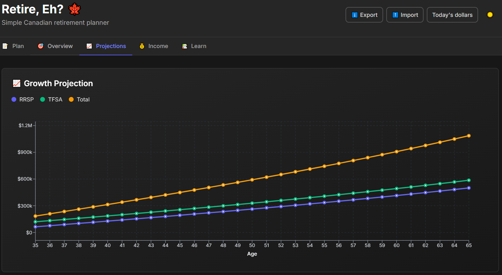

# Retire, Eh? 🍁

[](https://github.com/halfguru/retire-eh/actions/workflows/ci.yml)
[](https://github.com/halfguru/retire-eh/actions/workflows/deploy.yml)
[](https://opensource.org/licenses/MIT)

> Plan your Canadian retirement, eh?

A household-first retirement planner for Canadians. Build an RRSP, TFSA, and CPP strategy with conservative projections and transparent math. Everything runs locally in your browser.



**[Live Demo](https://halfguru.github.io/retire-eh/)**

## Features

- **Household-first dashboard** with combined progress across people
- **Canadian-focused**: RRSP, TFSA, and CPP planning built in
- **Visual projections** for portfolio growth over time
- **Goal tracking** against your retirement income target
- **Private by default**: all calculations run in-browser
- **Fast**: core math powered by Rust/WebAssembly

## Quick Start

```bash
git clone https://github.com/halfguru/retire-eh.git
cd retire-eh

# Build WASM and copy artifacts to frontend
cd backend && wasm-pack build --target web && cd ..
cp backend/pkg/retirement_core_bg.wasm frontend/public/wasm/
cp backend/pkg/retirement_core.js frontend/src/lib/
cp backend/pkg/retirement_core.d.ts frontend/src/lib/

cd frontend && npm install
npm run dev
```

Open http://localhost:5173 to view the app.

## Tech Stack

| Layer | Technology |
|-------|------------|
| Frontend | React + TypeScript + Tailwind CSS |
| Charts | Recharts |
| Calculations | Rust compiled to WebAssembly |

The Rust core keeps all financial logic in one place: deterministic, testable, and fast in the browser.

## Development

### Frontend

```bash
npm run dev        # Start dev server
npm run build      # Production build
npm run typecheck  # TypeScript check
npm run lint       # ESLint
```

### Backend (Rust/WASM)

```bash
cd backend
cargo build        # Build Rust
cargo test         # Run tests
cargo clippy       # Lint
wasm-pack build --target web  # Build WASM
```

### AI-Assisted Development

See [AGENTS.md](./AGENTS.md) for build commands and conventions.

## Design Philosophy

- **Conservative assumptions**: realistic projections over optimistic ones
- **Explicit explanations**: the math is always visible
- **Household-first approach**: savings evaluated jointly across partners

> One household balance sheet, multiple tax wrappers.

Retirement success is a household outcome. Savings get evaluated jointly regardless of who contributes, with strategic allocation between RRSP and TFSA based on marginal tax rates.

## What This Doesn't Do

- Bank account linking or real-time market data
- Complex tax optimization engines or Monte Carlo simulations
- FIRE or early-retirement evangelism
- Non-Canadian retirement accounts (401k, IRA, etc.)

## License

MIT. See [LICENSE](LICENSE) for details.
